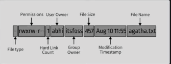

# 1_testShell00

```
cd ex01
vi testShell00
    // add 40 char to the file
:wq

    // we should change the permission form writing to only read
    // 1-change mode to -r--r--r--
chmod u-w testShell00
    // 2-change mode to -r--r-xr--
chmod g+x testShell00
    // 3-change mode to -r--r-xr-x
chmod o+x testShell00

    // change timestamp to 2021 jun 1 at 23:42
touch -a -m -t 202106012342.00 testShell00

    // last step
tar -cf testShell00.tar testShell00

    // check the result
ls -l

    // keep only the testShell00.tar
rm testShell00


```

[Video file permission](https://youtu.be/JEtiMbiKp2Y?si=ohzcnq4AK0Lg_v5s&t=2471)

[Video change data&time of file creation](https://youtu.be/JEtiMbiKp2Y?si=OTIySHM7CGTKdm-Q&t=2724)

# 2_oh yeah, mooore..



```
cd ex02

    // create test0
mkdir test0
    // change from drwxr-xr-x to drwx--xr-x
chmod 715 test0
    // change the timestamp
touch -t 06012047 test0
ls -l
---------------------------
    // create test1
touch test1
    // change from -rw-r--r--  to -rwx--xr--
chmod 714 test1
    // change the number of char that show before Jun to 4
printf "1234" > test1
    // change the timestamp as last edit was in Jun 1
touch -t 06012146 test1
ls -l
-----------------
    // create test2
mkdir test2
    // change permission from drwxr-xr-x to dr-x---r--
chmod 504 test2
    // change the last edit was in Jun 1
touch -t 06012245 test2
ls -l
-------------------------
    // create test3
touch test3
    // change the number of char that show before Jun to 1
printf "a" > test3
    // change permission from -rw-r--r-- to -r-----r--
chmod 404 test3
    // last edit was in Jun 1
touch -t 06012344 test3
ls -l
------------------------ -
    // create test4
touch test4
    // change the number of char that show before Jun to 2
printf "aa" > test4
    // change permission from -rw-r--r-- to -rw-r----x
chmod 641 test4
    // last edit was in Jun 1
touch -t 06012343 test4
ls -l
```

###### test5 -> Hard link

[video](https://youtu.be/K5tYeMWj4Vc?si=pOoHj7M2jYgN87d9&t=524) start from min: 8:44

[tutorial](https://linuxhandbook.com/hard-link/)

```
    // create test5:
    // we use hard link to connect the test5 to test3 as shortcut and both can get "hard link count: 2"
    // any change in test 3 effect test5

ln test3 test5
ls -l

-----------------------
    // create test6
ln -s test0 test6
    // last edit was in Jun 1 * NOT WORKING HERE *
touch -t 06012220 test6
ls -l

******************** last step ****
tar -cf exo2.tar *
rm -rf test*
```

# 3_Connect me!

`
// how to get Kerberos tickets in mac

Open Terminal.

Type kinit username, replacing “username” with your actual username.

Enter your password when prompted.

You can check your tickets by typing klist.

---

Please note that you need to have the Kerberos client installed on your system to use these commands2. Also, you must be connected to a network that has a Kerberos Key Distribution Center (KDC).

Remember, you should have the necessary permissions to run these commands

`

# 3_SSH me!

```
    // first create the key in terminal
ssh-keygen

    //enter
    //you can add password or just enter
    // if you want pass passphrase or just enter
    // a box with aski code popup which and you can see your public and private key where exit

    // go to address of public key /Users/JM/.ssh/
    // open id_rsa.pub in vim or vscode
    // copy all the data in it
    // back to ex03
cd shell00/ex03
touch id_rsa_pub
    // use Vscode to paste, things inside of this file and save it
    // use vim
vi id_rsa_pub
    // past the data you did copy here
    // save and exit
:wq
    // check the file are correct
cat id_rsa_pub


```

[Video for create SSH key on any platform, Min: 01:06 ](https://youtu.be/oAbYL3bktMA?si=URsZq_OH2TN8xoBE&t=65)

[video from Arab 1337, min 22:37](https://youtu.be/K5tYeMWj4Vc?si=QRXzV9pcOUJXbqNl&t=1357)

# 4_midLS

```
    // show file as list, it sorted by creation, separated by comma, folder has slash

mkdir ex04
cd ex04
vi midLS

        // inside of the file write this command
    ls -m -t -p
         //save file exit

cat midLS

```

[video](https://youtu.be/h2JP2vyt6kU?si=9HWn9-VTZswGeH1M&t=481)

# 5_Git commit?

```
    // git log shows the pervious details about our commit

mkdir ex06
cd ex06
vi git_commit.sh
         // add this comment inside of file
    git log --format='%H' -n5
         // save and exit

cat git_commit.sh

```

[video](https://youtu.be/JI5cBi1LzXg?si=EXMnePV5SpllhM-2&t=184)

# 6_gitignore

```
mkdir ex06
cd ex06

vi git_ignore.sh
           // add this comment in file
    git ls-files --others --ignored --exclude-standard
           // save and exit
cat git_ignore.sh
```

[Video](https://youtu.be/icDgvKSWDgs?si=5KbjpMS_WADmKLON)
